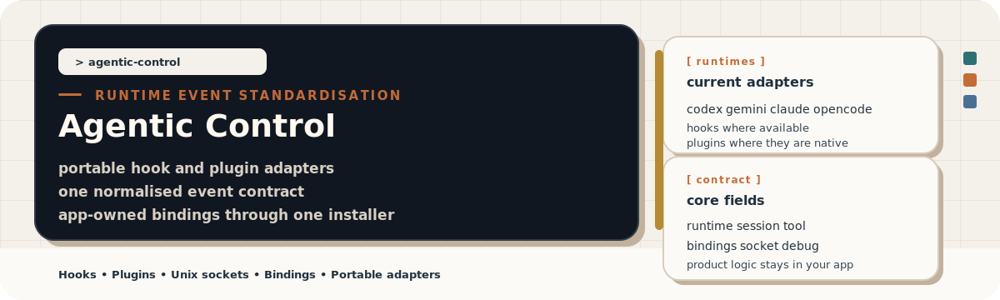
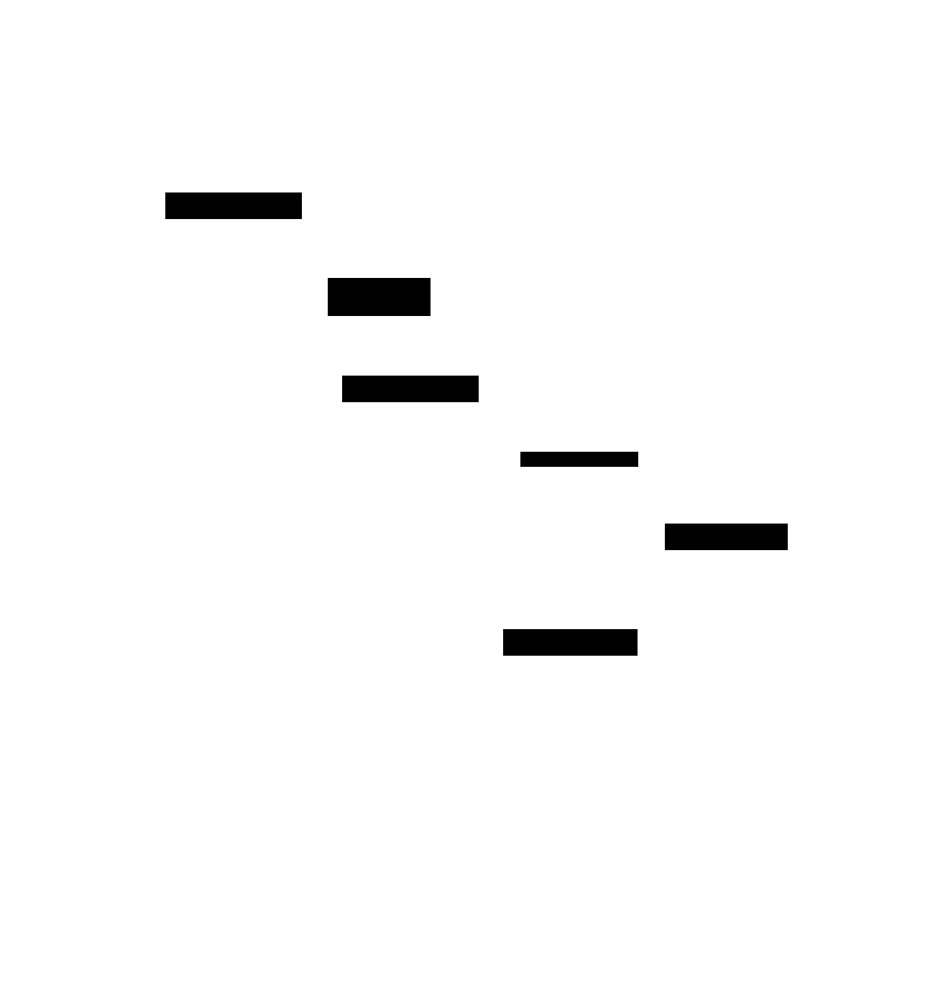
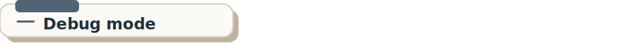

`Agentic Control` gives host applications one app-owned way to observe and
control multiple agent runtimes without baking vendor-specific behaviour into
the product layer. Use `agent_control` when your application needs to start,
resume, interrupt, and answer runtime requests directly. Use `agent_harness`
when you need passive hook or plugin observation for unmanaged sessions,
investigation, or diagnostics.

This repository is designed around three outcomes:

- Keep runtime instrumentation generic enough to port between applications.
- Keep correlation explicit so the helper never assumes your internal role
  model or environment variable names.
- Keep setup practical with one shared installer, a shared helper binary, and
  a live debug mode that mirrors the production transport.

---


Choose your integration path first:

- `agent_control`
  Use this when your application owns the session lifecycle and needs a unified
  control plane across Codex, Gemini, Claude, and OpenCode.
- `agent_harness`
  Use this when the runtime is launched elsewhere and you only need passive
  hook or plugin events translated into the shared event contract.

If you are integrating this into a host product, start with:

- [`docs/control-plane.md`](./docs/control-plane.md) for app-managed sessions
- [`docs/integration.md`](./docs/integration.md) for the host integration model
- the runtime guide for the runtime you are wiring in first

The public surface stays intentionally small. The shared helper binary
starts at [`cmd/agent-harness/main.go`](./cmd/agent-harness/main.go), the
runtime translation logic lives in [`internal/harness/`](./internal/harness),
and the shared contracts live in [`pkg/contract/`](./pkg/contract). The
provider-facing Go boundary for the controller lives in
[`pkg/controlplane/`](./pkg/controlplane). The Go `agent_harness` binary
owns event translation, hook and plugin bundle installation, bundle removal,
and interactive live-run diagnostics. [`runtimes/`](./runtimes) contains the
runtime-specific fixtures, prompts, plugin source, and notes. [`docs/`](./docs)
holds the durable contract and integration guidance. [`mise.toml`](./mise.toml)
and [`hk.pkl`](./hk.pkl) are the source of truth for local automation, and
[`scripts/`](./scripts) holds only the README asset generator and README
validator.

The repository has two runtime surfaces:

- `agent_harness` for passive hook and plugin observation
- `agent_control` for app-owned Codex, Gemini, Claude, and OpenCode sessions

`agent_control` exposes a single bootstrap call, `system.describe`, so host
applications can discover runtime capabilities before they start or resume
sessions.

`agent_control` is the primary integration surface for new application
work. `agent_harness` is the secondary path for passive observation,
investigation, unmanaged external sessions, and native hook or plugin capture.

The repository stays generic on purpose. It does not know about your internal
roles, workflow states, or ownership model. Instead, your application chooses
what to bind and what to infer. The helper only translates runtime-native
signals into a stable, app-owned event stream.

Runtime coverage:

- Codex via native hooks and `codex app-server`
- Gemini via native hooks and `gemini --acp`
- Claude via native hooks and a local Claude Agent SDK bridge
- OpenCode via native plugins and `opencode serve`

---


If you want a quick local evaluation, build the binaries and replay the sample
fixtures first:

```bash
mise trust
mise install
mise run build
mise run diag:fixtures:codex
mise run diag:fixtures:gemini
mise run diag:fixtures:claude
mise run diag:fixtures:opencode
```

The helper builds with Go. You do not need a Zig toolchain to replay
fixtures or install the runtime bundles. The build also bootstraps the Claude
Agent SDK bridge dependency the first time you compile `agent_control`.

The most useful local commands are:

| Command | Purpose |
| --- | --- |
| `mise run build` | Build `agent_harness` and `agent_control`. |
| `mise run diag:listen` | Start a local debug listener on the default socket. |
| `mise run control:serve` | Start the Go control-plane on a local Unix socket. |
| `mise run diag:fixtures:codex` | Replay every Codex fixture through the helper. |
| `mise run diag:fixtures:gemini` | Replay every Gemini fixture through the helper. |
| `mise run diag:fixtures:claude` | Replay every Claude fixture through the helper. |
| `mise run diag:fixtures:opencode` | Replay every OpenCode fixture through the helper. |
| `mise run diag:install:codex` | Install the repo-local Codex bundle for live testing. |
| `mise run diag:install:gemini` | Install the repo-local Gemini bundle for live testing. |
| `mise run diag:install:claude` | Install the repo-local Claude bundle for live testing. |
| `mise run diag:install:opencode` | Install the global OpenCode bundle for live testing. |
| `mise run diag:codex:smoke` | Run a live Codex smoke scenario. |
| `mise run diag:codex:bash` | Run a live Codex Bash scenario. |
| `mise run diag:codex:approval` | Run a live Codex approval scenario. |
| `mise run diag:gemini:smoke` | Run a live Gemini smoke scenario. |
| `mise run diag:gemini:bash` | Run a live Gemini Bash scenario. |
| `mise run diag:gemini:approval` | Run a live Gemini approval scenario. |
| `mise run diag:claude:smoke` | Run a live Claude smoke scenario. |
| `mise run diag:claude:bash` | Run a live Claude Bash scenario. |
| `mise run diag:claude:approval` | Run a live Claude approval scenario. |
| `mise run diag:opencode:smoke` | Run a live OpenCode smoke scenario. |
| `mise run diag:opencode:bash` | Run a live OpenCode Bash scenario. |
| `mise run diag:opencode:approval` | Run a live OpenCode approval scenario. |

For direct helper usage without `mise`, run:

```bash
.artifacts/bin/agent_harness listen --socket-path /tmp/agent-harness.sock
.artifacts/bin/agent_harness --runtime codex --stdout < runtimes/codex/fixtures/session_start.json
.artifacts/bin/agent_harness install --runtime codex --scope repo --socket-env AGENT_HARNESS_SOCKET
.artifacts/bin/agent_harness uninstall --runtime codex --scope repo
.artifacts/bin/agent_control serve --socket-path /tmp/agentic-control.sock
.artifacts/bin/agent_control describe --socket-path /tmp/agentic-control.sock
```

---


Each runtime bundle is kept independent so that the shared contract does not
need to change when a vendor changes its hook surface.

Installation is centralised. Use the shared Go installer with `--runtime` and,
when needed, `--scope`:

```bash
.artifacts/bin/agent_harness install --runtime codex --scope repo --socket-env AGENT_HARNESS_SOCKET
.artifacts/bin/agent_harness install --runtime gemini --scope repo --socket-env AGENT_HARNESS_SOCKET
.artifacts/bin/agent_harness install --runtime claude --scope repo --socket-env AGENT_HARNESS_SOCKET
.artifacts/bin/agent_harness install --runtime opencode --scope global --socket-env AGENT_HARNESS_SOCKET
```

To safely remove only the Agentic Control hook or plugin content later, use the
matching uninstall command:

```bash
.artifacts/bin/agent_harness uninstall --runtime codex --scope repo
.artifacts/bin/agent_harness uninstall --runtime gemini --scope repo
.artifacts/bin/agent_harness uninstall --runtime claude --scope repo
.artifacts/bin/agent_harness uninstall --runtime opencode --scope global
```

The hook bundles and live scenarios in this repository were validated on April
5, 2026 against these installed CLI versions:

| Runtime | Validated version | Install guide | Native reference |
| --- | --- | --- | --- |
| Codex | `codex-cli 0.118.0` | [Codex CLI quickstart and install](https://github.com/openai/codex#quickstart) | [Codex hooks](https://developers.openai.com/codex/hooks) |
| Gemini | `0.36.0` | [Gemini CLI installation](https://geminicli.com/docs/get-started/installation/) | [Gemini CLI hooks reference](https://geminicli.com/docs/hooks/reference/) |
| Claude | `2.1.84 (Claude Code)` | [Claude Code setup](https://docs.claude.com/en/docs/claude-code/setup) | [Claude Code hooks reference](https://code.claude.com/docs/en/hooks) |
| OpenCode | `1.3.15` | [OpenCode install guide](https://opencode.ai/docs/) | [OpenCode plugins](https://opencode.ai/docs/plugins/) |

If you are running different versions, rerun the fixture replay and live
diagnostic tasks before assuming the same hook payloads or launch behaviour.

Runtime guides:

- [Codex runtime guide](docs/codex.md)
- [Gemini runtime guide](docs/gemini.md)
- [Claude runtime guide](docs/claude.md)
- [OpenCode runtime guide](docs/opencode.md)
- [Control-plane guide](docs/control-plane.md)

Official reference links:

- [Codex hooks](https://developers.openai.com/codex/hooks)
- [Codex plugins](https://developers.openai.com/codex/plugins)
- [Codex plugin packaging](https://developers.openai.com/codex/plugins/build)
- [Gemini CLI hooks guide](https://geminicli.com/docs/hooks/)
- [Gemini CLI hooks reference](https://geminicli.com/docs/hooks/reference/)
- [Claude Code hooks reference](https://code.claude.com/docs/en/hooks)
- [OpenCode install guide](https://opencode.ai/docs/)
- [OpenCode plugins](https://opencode.ai/docs/plugins/)
- [OpenCode config](https://opencode.ai/docs/config/)
- [OpenCode permissions](https://opencode.ai/docs/permissions/)
- [OpenCode server](https://opencode.ai/docs/server/)

The repository uses the strongest native extension surface each runtime
exposes. That means hooks where a runtime provides hooks, and plugins where a
runtime exposes plugin-native lifecycle events. The event contract stays built
around hook-like investigation signals rather than indirect tool shims.

Repo-local installation is the default for Codex, Gemini, and Claude. OpenCode
is global by default because it already auto-loads plugins from a dedicated
global plugin directory without editing `opencode.json`. Every runtime
supports an explicit `repo` or `global` install mode where that distinction is
useful. When you install both a global and a repo-local OpenCode bundle, the
repo-local bundle is the active bundle for that repository, and the global
plugin does not emit duplicate events.

Install and uninstall are intentionally runtime-local. The Go installer
keeps each bundle under the runtime’s own repo-local or global config tree so
it can remove only the Agentic Control content later without guessing about
shared state.

For host applications, that means you can adopt the runtime bundle that matches
your immediate need without leaking app-specific naming into the shared helper.
Your application decides what to bind. The helper only standardises the native
payload shape and transport.

---


The normalised event contract is documented in
[docs/contract.md](./docs/contract.md), and the machine-readable Go contract
types live in [`pkg/contract/`](./pkg/contract). At a high level, every event
contains:

- runtime identity
- native event name
- normalised event type
- a concise summary
- runtime-native session or tool identifiers when available
- optional `bindings` contributed by the host application

The normalised event families are:

- `session.started`
- `session.ended`
- `turn.user_prompt_submitted`
- `turn.finished`
- `turn.failed`
- `turn.stopped`
- `tool.started`
- `tool.finished`
- `tool.failed`
- `tool.permission_requested`
- `notification`
- `runtime.event`

The helper preserves native identifiers where the runtime exposes them. That is
why the contract includes fields such as `session_id`, `turn_id`,
`tool_call_id`, `tool_name`, `command`, `cwd`, `model`, `transcript_path`, and
`runtime_pid` when they are available.

If you want the runtime-specific details behind those fields, read the
dedicated reference pages:

- [Codex runtime guide](docs/codex.md)
- [Gemini runtime guide](docs/gemini.md)
- [Claude runtime guide](docs/claude.md)
- [OpenCode runtime guide](docs/opencode.md)

The session and event types used by the Go control-plane also live in
[`pkg/contract/controlplane.go`](./pkg/contract/controlplane.go).

---


Bindings are the mechanism that keeps the helper portable. Instead of assuming
that every application exports the same environment variables, the helper lets
you opt into correlation explicitly.

If your application exports:

- `APP_LAUNCH_ID`
- `APP_SESSION_ID`
- `APP_ACTOR_ID`
- `APP_HOST_ID`

you can pass:

```bash
--bind-env launch_id=APP_LAUNCH_ID \
--bind-env app_session_id=APP_SESSION_ID \
--bind-env actor_id=APP_ACTOR_ID \
--bind-env host_id=APP_HOST_ID
```

You can also attach fixed values:

```bash
--bind-value environment=staging
```

If you do not pass any `--bind-env` or `--bind-value` flags, the helper emits
no application-level bindings at all.

This is the key portability rule for the repository: the runtime layer speaks a
generic contract, and your application decides what each binding means.

---




The runtime flow is deliberately simple:

1. A runtime hook or plugin fires.
2. The runtime invokes `agent_harness`.
3. The helper reads the incoming payload, maps it to the shared contract, and
   appends any requested bindings.
4. The helper writes the event to a local receiver or to `stdout`.
5. Your application consumes that stream and derives higher-level state.

That design keeps the helper as a deep module with a simple interface. The
runtime-specific translation logic lives in one place, while application logic
stays outside the repository.

---



The repository supports two operating modes.

Product mode is the real integration path. Your application launches the
runtime, injects any binding environment variables it wants to expose, and
points the helper at a local receiver through `--socket-path` or
`--socket-env`.

Debug mode is intentionally explicit. It is there to help you verify what a
runtime is sending and how the helper is translating it. The simplest path is:

```bash
mise run diag:listen
```

In another terminal, run a live scenario:

```bash
mise run diag:codex:smoke
mise run diag:gemini:bash
mise run diag:claude:approval
```

The Go `agent_harness run` command starts a listener, sets
`AGENT_HARNESS_SOCKET`, launches the runtime in an approval-capable mode, and
prints live `[hook]` lines as events arrive.

This repository deliberately keeps approval-sensitive scenarios in place. The
live diagnostic paths are not YOLO-mode shortcuts because the goal is to verify
actual runtime behaviour, including approval gates.

---


The README presentation layer is generated and checked from source. That keeps
the documentation maintainable rather than turning it into a one-off manual
layout exercise.

The main support tooling is:

- [`scripts/generate_assets.py`](./scripts/generate_assets.py) generates the
  banner and section headers used by the README.
- [`scripts/validate_readme.py`](./scripts/validate_readme.py) verifies that
  the README references the expected assets and local paths.
- [`cmd/agent-harness/main.go`](./cmd/agent-harness/main.go) also exposes
  the Go `install`, `uninstall`, and `run` subcommands used for live runtime
  diagnostics and hook or plugin bundle management.
- [`assets/architecture.d2`](./assets/architecture.d2) is the source of truth
  for the sequence diagram embedded above as
  [`assets/architecture.svg`](./assets/architecture.svg).

The generated assets live in [`assets/`](./assets). When you change the README
structure or visual language, regenerate the assets and rerun the README
validator.

```bash
mise run generate-assets
mise run validate-docs
```

---


The repository is split into a small number of clear modules:

| Path | Purpose |
| --- | --- |
| [`cmd/`](./cmd) | Binary entrypoints for the shared helper and future control-plane tools. |
| [`internal/harness/`](./internal/harness) | Shared hook and plugin translation logic. |
| [`internal/controlplane/`](./internal/controlplane) | Active-session registry, event bus, server, and provider implementations. |
| [`pkg/contract/`](./pkg/contract) | Shared Go contract types for harness and control-plane work. |
| [`pkg/controlplane/`](./pkg/controlplane) | Provider-native control-plane interfaces and request types. |
| [`runtimes/`](./runtimes) | Runtime-specific fixtures, prompts, plugin source, and notes. |
| [`docs/`](./docs) | Durable contract and integration documentation. |
| [`scripts/`](./scripts) | Asset generation and README validation. |
| [`assets/`](./assets) | Generated README visuals. |
| [`mise.toml`](./mise.toml) | Local automation entrypoint. |
| [`hk.pkl`](./hk.pkl) | hk hook and verification configuration. |

## Next steps

If you want to integrate this into another application, start with
[docs/integration.md](./docs/integration.md), install the runtime bundle you
need, and decide what your host application wants to bind as `launch_id`,
`app_session_id`, `actor_id`, and `host_id`.
